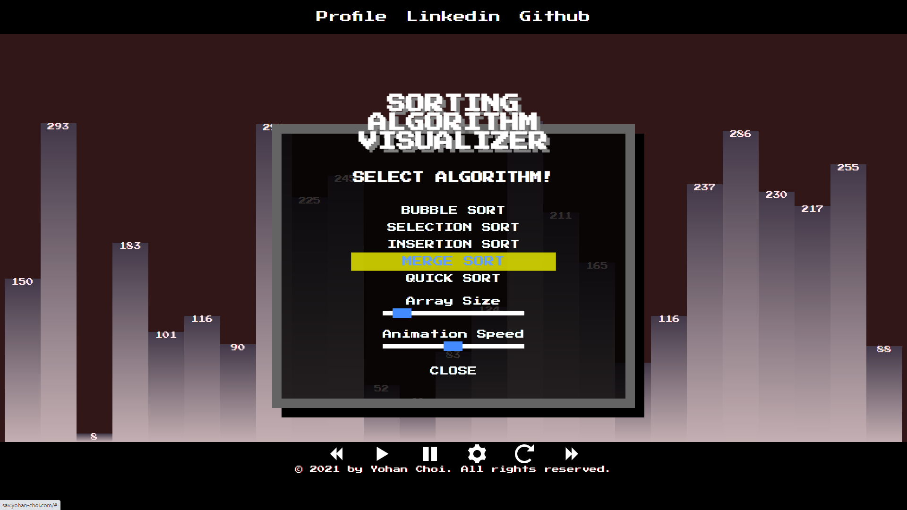
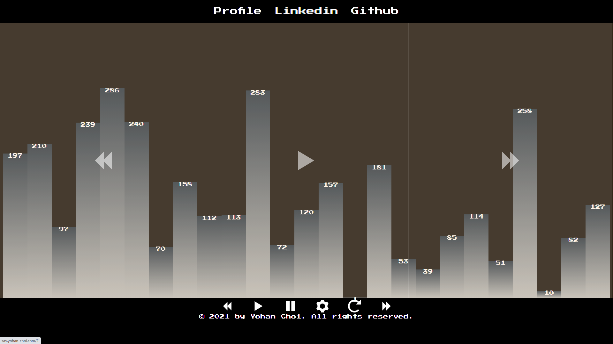
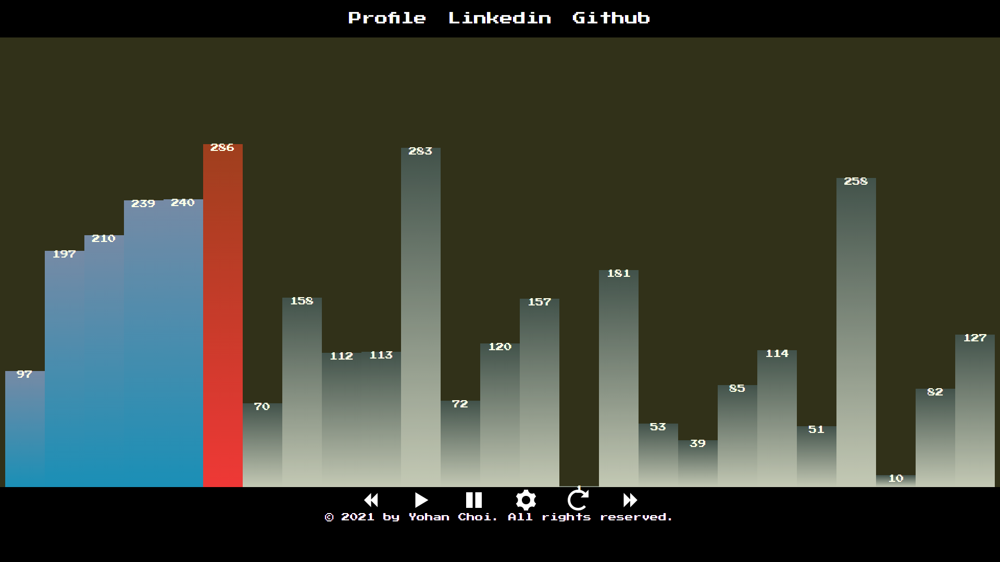
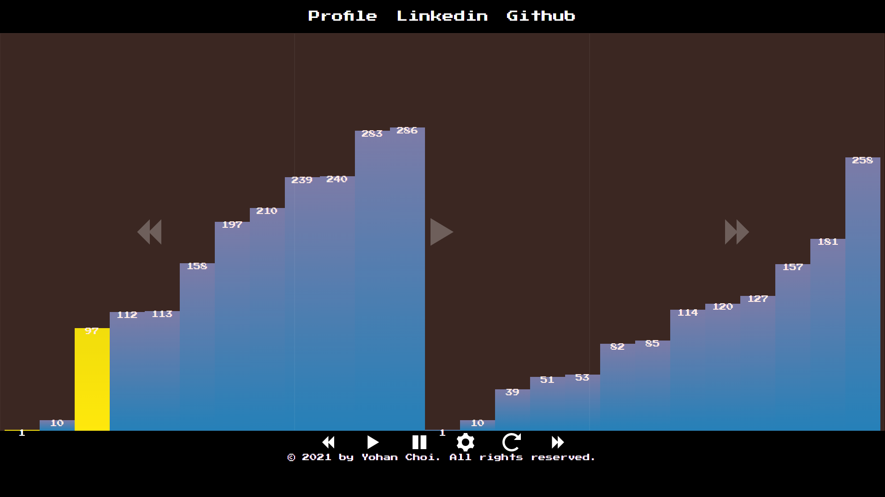
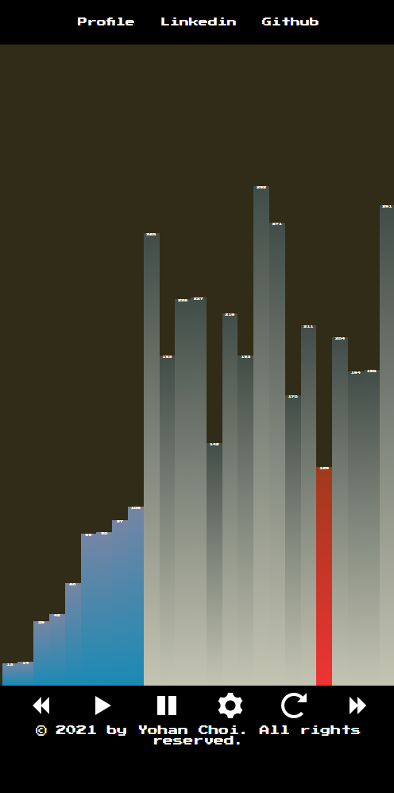

# Sorting Algorithm Visualizer

Thank you for visiting!

## [Live Demo](http://sav.yohan-choi.com/)

You can play with the sorting algorithm visualizer! [Live Demo](http://sav.yohan-choi.com/)

## Motivation

While I was learning sorting algorithms, I was wondering how each sorting algorithm would look.
It was pretty interesting to see how each algorithm looks, and it gave me a better understanding of sorting algorithms.
For instance, if a sorting algorithm uses the divide and conquers approach, you can see the pattern of self-imitation.

## Features

### Sorting Algorithm Animations
1. Bubble Sort
2. Selection Sort
3. Insertion Sort
4. Merge Sort
5. Quick Sort

### Animation Controller
By default, you can play, pause, forward, backward the sorting algorithm animation. 

In a desktop environment, you can control the image with a keyboard. 
(<-: backward, space: play/pause, ->: forward) 

In Mobile, you can control the animation with wide buttons on the animation.
(left: backward, center: play/pause, right: forward)

## How is works?
It is built with React Hooks and Sass. When a user triggers the play function, the animation utility will record each step of the sorting algorithm while the sorting algorithm runs and sorts the actual array. Once the recording is completed, the record will be played by the player function. The player function calls from the generator function, and the generator only updates the frame of the animation only when the player can run the animation. Before it updates an element on the DOM, the application stores the element's original status in the undo stack. In that way, the application can run backward and forward without any problem.

## Screenshots

